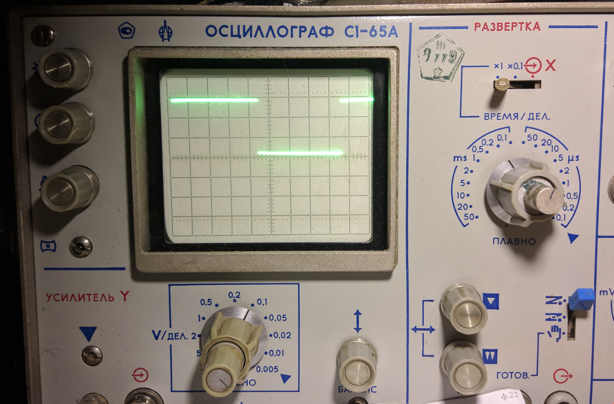

# VT1211 GPIO Library

Userspace библиотека для работы с портами GPIO Super I/O контроллера VIA VT1211. Была написана в процессе раскуривания работы контроллера. Выложена в академических целях, позволяет разобраться в работе с контроллером, не отвлекаясь на API ядра Linux. Использовать её для решения реальных задач не рекомендую, ибо это не Ъ-way. 

[git репозиторий с модулем ядра](https://github.com/manfredmann/vt1211_gpio_k)

По ссылке вы найдёте готовый модуль ядра, а также описание работы с контроллером.

## Сборка и установка

Все действия выполняются под Debian GNU/Linux (Stretch)

Установим необходимые пакеты

```
# apt install git automake autoconf build-essential
```

Получим, соберём, и установим библиотеку

```
# cd /usr/local/src
# git clone
# cd vt1211_gpio
# autoreconf -vi
# ./configure --prefix=/usr/local
# make
# make install
# ls -la /usr/local/lib | grep gpio
-rw-r--r-- 1 root staff 36718 Feb 25 16:21 libvt1211_gpio.a
# 
# ls -la /usr/local/include | grep gpio
-rw-r--r-- 1 root staff 3067 Feb 25 16:21 vt1211_gpio.h
```

## Пример простой программы

Сгенерируем прямоугольник на 1 ноге порта 1

```Cpp
#include <stdio.h>
#include <stdlib.h>
#include <unistd.h>
#include <time.h>
#include <vt1211_gpio.h>

int main(int argc, char *argv[]) {
  printf("==============================================\n");
  printf("Request I/O privileges:\t");

  if (!io_request()) {
    printf("ERROR\n");
    return EXIT_FAILURE;
  } else {
    printf("OK\n");
  }

  printf("VT1211 Init:\t\t");

  int r = vt_init(VT_CONFIG_PORT_1 | VT_CONFIG_PORT_3_6);

  switch (r) {
    case VT_INIT_NOT_FOUND: {
      printf("ERROR VT1211 Not found\n");
      printf("==============================================\n");
      return EXIT_FAILURE;
    }
    case VT_INIT_NO_PORT: {
      printf("ERROR No port selected\n");
      printf("==============================================\n");
      return EXIT_FAILURE;
    }
    case VT_INIT_OK:
    default: {
      printf("OK\n");
    }
  }

  uint8_t vt_id     = vt_get_dev_id();
  uint8_t vt_rev    = vt_get_dev_rev();
  uint16_t vt_base  = vt_get_baddr();

  printf("VT1211 ID: %02X, Revision: %02X, Base addr.: %04x\n", vt_id, vt_rev, vt_base);
  printf("==============================================\n");

  vt_port_mode(VT_PORT_1, VT_PORT_OUTPUT);
  vt_port_polarity(VT_PORT_1, VT_PORT_PL_DIRECT);
  vt_port_write(VT_PORT_1, 0x00);

  while(1) {
    vt_pin_hi(VT_PORT_1, VT_PIN_0);
    usleep(2000);
    vt_pin_low(VT_PORT_1, VT_PIN_0);
    usleep(2000);
  }

  return EXIT_SUCCESS;
}
```

Соберём и запустим.
<span style="color:red; font-weight: bold">
ВНИМАНИЕ! Запускать от имени root, иначе не удастся получить доступ к пространству I/O
</span>

```
# gcc main.c -lvt1211_gpio -o vt1211_test
# ./vt1211_test
==============================================
Request I/O privileges: OK
VT1211 Init:            OK
VT1211 ID: 3C, Revision: 02, Base addr.: 0800
==============================================

```

Подключим осциллограф к 1 ноге порта 1, и увидим:



## API

```Cpp
int       vt_init(uint8_t ports);
```
Инициализация контроллера.

**Параметры**
- uint8_t ports - Какие порты использовать

**Возвращаемое значение**

Смотри defines

---

```Cpp
uint8_t   vt_get_dev_id();
```

Возврашает идентификатор Super I/O контроллера

---

```Cpp
uint8_t   vt_get_dev_rev();
```

Возврашает ревизию Super I/O контроллера

---

```Cpp
uint16_t  vt_get_baddr();
```

Возврашает базовый адрес в пространстве I/O для работы с портами.

---

```Cpp
void      vt_port_mode(uint8_t port, uint8_t mode);
```
Установка режим работы порта. На ввод или вывод

**Параметры**
- uint8_t port - Номер порта
- uint8_t mode - Режим работы порта

---

```Cpp
void      vt_port_polarity(uint8_t port, uint8_t polarity);
```
Инверсия разрядов порта

**Параметры**
- uint8_t port - Номер порта
- uint8_t polarity - Прямой/инверсный

---

```Cpp
void      vt_port_write(uint8_t port, uint8_t data);
```

Запись в порт

**Параметры**
- uint8_t port - Номер порта
- uint8_t data - Данные

---

```Cpp
uint8_t   vt_port_read(uint8_t port);
```

Чтение порта

**Возвращаемое значение**

Прочитанные данные

---

```Cpp
void      vt_pin_mode(uint8_t port, uint8_t pin, uint8_t mode);
```

Режим работы пина. Ввод или вывод

**Параметры**
- uint8_t port - Номер порта
- uint8_t pin - Номер пина
- uint8_t mode - Режим работы пина

---

```Cpp
void      vt_pin_polarity(uint8_t port, uint8_t pin, uint8_t polarity);
```

Инверсия пина

**Параметры**
- uint8_t port - Номер порта
- uint8_t pin - Номер пина
- uint8_t polarity - Прямой/инверсный

---

```Cpp
void      vt_pin_set(uint8_t port, uint8_t pin, uint8_t value);
```

Установить пин в 0 или 1

**Параметры**
- uint8_t port - Номер порта
- uint8_t pin - Номер пина
- uint8_t value - 0 или 1

---

```Cpp
uint8_t   vt_pin_get(uint8_t port, uint8_t pin);
```

Прочитать значение пина

**Параметры**
- uint8_t port - Номер порта
- uint8_t pin - Номер пина

**Возвращаемое значение**

Значение пина

---

## DEFINES

Порты для инициализации

```Cpp
#define VT_CONFIG_PORT_1              0x01
#define VT_CONFIG_PORT_3_6            0x04
```

Возвращаемые значения функции инициализации

```Cpp
#define VT_INIT_OK                    0x00
#define VT_INIT_NOT_FOUND             0x01
#define VT_INIT_NO_PORT               0x02
```


Номера портов

```Cpp
#define VT_PORT_1                     0x00 //GP10...GP17
#define VT_PORT_3                     0x01 //GP30...GP37
#define VT_PORT_4                     0x02 //GP40...GP47
#define VT_PORT_5                     0x03 //GP50...GP57
#define VT_PORT_6                     0x04 //GP60...GP62
```

Режим работы порта. Ввод или вывод

```Cpp
#define VT_PORT_INPUT                 0x00
#define VT_PORT_OUTPUT                0xFF
```

Инверсия разрядов порта

```Cpp
#define VT_PORT_PL_DIRECT             0x00
#define VT_PORT_PL_INVERSE            0xFF
```

Режим работы отдельного пина. Ввод или вывод.

```Cpp
#define VT_PIN_INPUT                  0x1
#define VT_PIN_OUTPUT                 0x0
```

Инверсия одного пина

```Cpp
#define VT_PIN_PL_DIRECT              0x0
#define VT_PIN_PL_INVERSE             0x1
```

Номера пинов

```Cpp
#define VT_PIN_0                     (0x1)
#define VT_PIN_1                     (0x1 << 1)
#define VT_PIN_2                     (0x1 << 2)
#define VT_PIN_3                     (0x1 << 3)
#define VT_PIN_4                     (0x1 << 4)
#define VT_PIN_5                     (0x1 << 5)
#define VT_PIN_6                     (0x1 << 6)
#define VT_PIN_7                     (0x1 << 7)
```